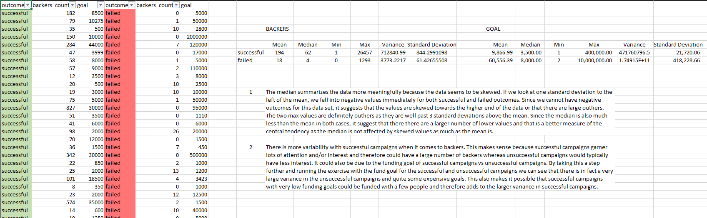
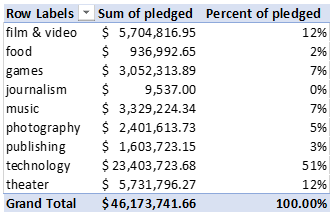
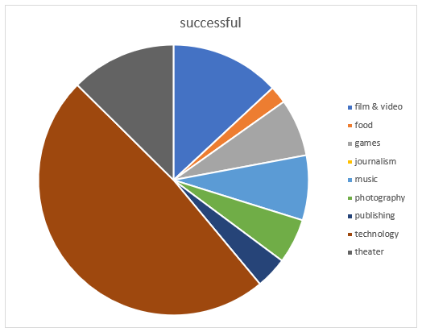

# Excel Homework: Kickstart My Chart

## Background

Over $2 billion has been raised using the massively successful crowdfunding service, Kickstarter, but not every project has found success. Of the more than 300,000 projects launched on Kickstarter, only a third have made it through the funding process with a positive outcome.

Getting funded on Kickstarter requires meeting or exceeding the project's initial goal, so many organizations spend months looking through past projects in an attempt to discover some trick for finding success. For this week's homework, you will organize and analyze a database of 4,000 past projects in order to uncover any hidden trends.

## Instructions

Using the Excel table provided, modify and analyze the data of 4,000 past Kickstarter projects as you attempt to uncover some market trends.

* Use conditional formatting to fill each cell in the `state` column with a different color, depending on whether the associated campaign was successful, failed, or canceled, or is currently live.

  * Create a new column O called `Percent Funded` that uses a formula to uncover how much money a campaign made to reach its initial goal.

* Use conditional formatting to fill each cell in the `Percent Funded` column using a three-color scale. The scale should start at 0 and be a dark shade of red, transitioning to green at 100, and blue at 200.

  * Create a new column P called `Average Donation` that uses a formula to uncover how much each backer for the project paid on average.

  * Create two new columns, one called `Category` at Q and another called `Sub-Category` at R, which use formulas to split the `Category and Sub-Category` column into two parts.

  

  * Create a new sheet with a pivot table that will analyze your initial worksheet to count how many campaigns were successful, failed, canceled, or are currently live per **category**.

  * Create a stacked column pivot chart that can be filtered by country based on the table you have created.

  

  * Create a new sheet with a pivot table that will analyze your initial sheet to count how many campaigns were successful, failed, or canceled, or are currently live per **sub-category**.

  * Create a stacked column pivot chart that can be filtered by country and parent-category based on the table you have created.

* The dates stored within the `deadline` and `launched_at` columns use Unix timestamps. Fortunately for us, [there is a formula](https://www.extendoffice.com/documents/excel/2473-excel-timestamp-to-date.html) that can be used to convert these timestamps to a normal date.

  * Create a new column named `Date Created Conversion` that will use [this formula](https://www.extendoffice.com/documents/excel/2473-excel-timestamp-to-date.html) to convert the data contained within `launched_at` into Excel's date format.

  * Create a new column named `Date Ended Conversion` that will use [this formula](https://www.extendoffice.com/documents/excel/2473-excel-timestamp-to-date.html) to convert the data contained within `deadline` into Excel's date format.

  

  * Create a new sheet with a pivot table with a column of `state`, rows of `Date Created Conversion`, values based on the count of `state`, and filters based on `parent category` and `Years`.

  * Now create a pivot chart line graph that visualizes this new table.

* Create a report in Microsoft Word and answer the following questions.

1. Given the provided data, what are three conclusions we can draw about Kickstarter campaigns?
2. What are some limitations of this dataset?
3. What are some other possible tables and/or graphs that we could create?

## Bonus

* Create a new sheet with 8 columns:

  * `Goal`
  * `Number Successful`
  * `Number Failed`
  * `Number Canceled`
  * `Total Projects`
  * `Percentage Successful`
  * `Percentage Failed`
  * `Percentage Canceled`

* In the `Goal` column, create 12 rows with the following headers:

  * Less than 1000
  * 1000 to 4999
  * 5000 to 9999
  * 10000 to 14999
  * 15000 to 19999
  * 20000 to 24999
  * 25000 to 29999
  * 30000 to 34999
  * 35000 to 39999
  * 40000 to 44999
  * 45000 to 49999
  * Greater than or equal to 50000

  

* Using the `COUNTIFS()` formula, count how many successful, failed, and canceled projects were created with goals within the ranges listed above. Populate the `Number Successful`, `Number Failed`, and `Number Canceled` columns with this data.

* Add up each of the values in the `Number Successful`, `Number Failed`, and `Number Canceled` columns to populate the `Total Projects` column. Then, using a mathematical formula, find the percentage of projects that were successful, failed, or canceled per goal range.

* Create a line chart that graphs the relationship between a goal's amount and its chances at success, failure, or cancellation.

## Bonus Statistical Analysis

If one were to describe a successful crowdfunding campaign, most people would use the number of campaign backers as a metric of success. One of the most efficient ways that data scientists characterize a quantitative metric, such as the number of campaign backers, is by creating a summary statistics table.

For those looking for an additional challenge, you will evaluate the number of backers of successful and unsuccessful campaigns by creating **your own** summary statistics table.

* Create a new worksheet in your workbook, and create a column each for the number of backers of successful campaigns and unsuccessful campaigns.

  

* Use Excel to evaluate the following for successful campaigns, and then for unsuccessful campaigns:

  * The mean number of backers.

  * The median number of backers.

  * The minimum number of backers.

  * The maximum number of backers.

  * The variance of the number of backers.

  * The standard deviation of the number of backers.

* Use your data to determine whether the mean or the median summarizes the data more meaningfully.

* Use your data to determine if there is more variability with successful or unsuccessful campaigns. Does this make sense? Why or why not?

## Conclusions:

* Only about 53% of all campaigns are successful, with the most success found in theater, film & video, and music. Even though theater seems to have the largest number of successful campaigns overall, this category is only successful 60% of the time, meaning the Kickstarter fails or is cancelled 40% of the time. Music on the other hand seems to have a 77% rate of success leaving a mere 23% rate of failure or cancellation and technology seems to roughly be an even split amongst success, cancellation, and failure.

* Taking a closer look at the subcategories, we see that plays seem to tower above the rest. However, that does not mean this subcategory has the highest rate of success even though it has the greatest number of campaigns and is the most popular subcategory. If we look at classical music, documentary, electronic music, hardware, metal, nonfiction, pop, radio & podcasts, rock, shorts, tabletop games, and television, these subcategories have a 100% success rate with no failures or cancellations. Similarly we can see that animation, art books, audio, children’s books, drama, faith, fiction, food trucks, gadgets, jazz, mobile games, nature, people, places, restaurants, science fiction, translations, video games, web, and world music never succeed based on the data we have. This could be due to various factors such as the campaigns target goal being too large, not enough backers/interest, etc.

* The date the campaign was created also seems to influence whether it was successful or not. Campaigns that began in the earlier months of the year appear to have a higher rate of success that starts to decline after May and has a sharp drop after November. In fact, the lines intersect in December and the rate of success drops below the rate of failed campaigns. This suggest that there may be external factors that play a role in the success of a campaign such as seasonality or consumer spending habits. To conclude, it would be smart for campaigns to begin earlier in the year.

## Limitations:
* A table that would clarify this further would be the sum of funds pledged per category. The table below depicts that 51% of all funds were pledged in the category of technology despite only a third of the campaigns succeeding.

* One of the limitations of this dataset is that it focuses only on Kickstarter campaigns and does not include other crowdsourcing services. A collection of crowdsourcing platforms may give a different interpretation and we might be able to see differences between platforms in terms of categorical success, popularity, or other factors.
* Sample size for countries may not be statistically significant because the sample sizes are too small for some countries. In fact, 74% of the data in this dataset is from the US and there was only 1 campaign from SG.
* An additional limitation could be the location of the backers. Backers from anywhere in the world can fund a campaign so it would be interesting to see if a projects are typically funded by backers in the country of origin or if they are truly funded by people anywhere on the planet. Since different government entities impose different rules and regulations on what is allowed in their countries, some projects may fail simply because users from other countries would not have access to them and therefore would not fund them.

## Additional:
* A table or pie chart of categories based off the number of backers. This would give an idea of which categories may have had the greatest number of backers involved even if they were not popular in terms of success. Below is a pie chart that illustrates which categories had the largest number of backers. It makes it apparent that technology has many backers (38%) even though it did not appear to be a promising category in the prior tables and graphs.

